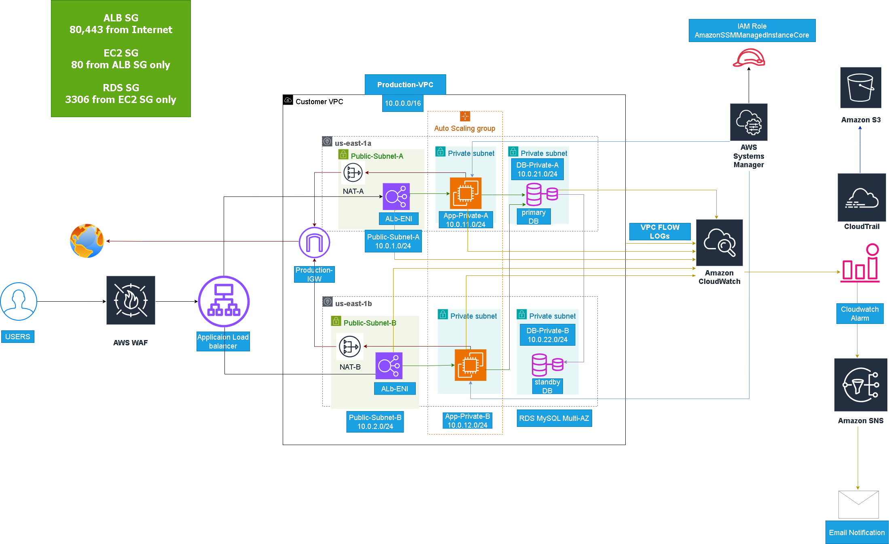
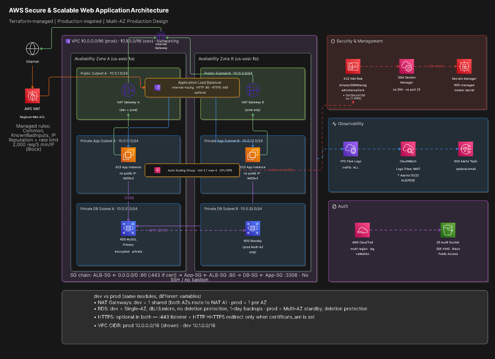

# Architecture Evolution and Design Provenance

## Purpose

This document explains why the repository contains two architecture diagrams and how they should be interpreted. Keeping both views is intentional: the original diagram demonstrates the author's design work during the manual AWS build, while the current diagram provides a cleaner reference for the Terraform-aligned architecture.

## Diagram 1 — initial Design



The original diagram was created during the manual AWS design and validation phase. It shows the author's initial reasoning about the VPC boundary, two Availability Zones, public and private subnets, ALB, NAT, EC2, RDS Multi-AZ, SSM, CloudWatch, CloudTrail, S3, SNS, and the security-group flow.

The file is preserved under `architecture/initial-architecture-diagram.png`. It was recovered from the original repository commit and is retained unchanged as a historical design artifact. Its Git history provides repository provenance; it should not be described as a machine-generated rendering.

## Diagram 2 — Current Terraform-aligned Reference



The current diagram was added after the Terraform migration and documentation review. It is not intended to erase or replace the original work. Its purpose is to make the current implementation and its boundaries easier to review.

The current reference view explicitly shows the EC2 IAM role with both:

- `AmazonSSMManagedInstanceCore` for Session Manager.
- `secretsmanager:GetSecretValue` scoped to the exact RDS master-secret ARN.

It also shows the private SSE-KMS audit bucket, the CloudTrail and VPC Flow Logs paths, the observability chain, and the separation between public entry points and private application/database tiers.

## Change Log

| Topic | initial design | Current Terraform-aligned documentation |
|---|---|---|
| Design ownership | Original architecture drawing created for the manual build | Original drawing retained unchanged and shown first in the README |
| Implementation reference | High-level design and manually validated environment | Terraform modules and environment-specific configuration are the implementation reference |
| IAM | SSM role was shown at a high level | SSM plus one exact-ARN Secrets Manager read permission is documented |
| Storage encryption | S3 and CloudTrail were shown without a precise algorithm label | Audit storage is described consistently as SSE-KMS |
| Evidence | Manual screenshots and validation results | Manual evidence and Terraform evidence are separated explicitly |
| Scaling | ASG was shown as part of the application tier | Dynamic scaling claims require an actual Terraform scaling policy and recorded test |
| HTTPS | Diagram communicates the edge path generally | Documentation states that HTTPS is conditional until an ACM certificate is configured |

## How to Present These Diagrams Professionally

The README displays the original diagram first under **initial Design — Human-authored Architecture Artifact**, followed by the current Terraform-aligned diagram. This order communicates progression rather than replacement:

1. **Design:** the author reasoned about the architecture and drew the initial solution.
2. **Build and validate:** the design was implemented manually and exercised in AWS.
3. **Codify:** the design was translated into reusable Terraform modules.
4. **Harden the documentation:** implementation-specific permissions, encryption, and evidence boundaries were made explicit.

The original diagram should be described as a **human-authored design artifact** or **initial architecture diagram**. Avoid claiming that a repository alone proves that no AI or other tool was used; Git history demonstrates provenance and continuity, while authorship claims should remain truthful and personal.

## Evidence Boundary

Neither diagram alone proves that all resources were deployed by Terraform. The original diagram represents the manual design phase. The current diagram represents the documented Terraform architecture. The repository must use test records, Terraform plans/applies, CloudWatch evidence, and AWS resource identifiers to prove deployment of the current configuration.

The recommended language is:

> The original architecture was designed and drawn manually, validated through an initial AWS build, and then codified into reusable Terraform modules. The repository preserves both the original design artifact and the current implementation reference.

## Recommended Git History

Keep the original image as a separate file rather than overwriting it. The recommended filenames are:

```text
architecture/initial-architecture-diagram.png
architecture/architecture-diagram.png
architecture/architecture-diagram.mmd
```

The first file is historical and should not be edited. The second is the current review/reference image. The Mermaid source is the editable source for the current reference view.
